## 1. Introduction
Traffic congestion is a major issue faced in almost of the world’s major cities. One major contributor to it is the time vehicles have to wait at the traffic intersection. Traffic signals with fixed traffic-signal duration and sequence or those based purely on human extracted features, such as estimated vehicle queue size on a road at an intersection can result in sub-optimal traffic flow in real-time. In this paper we explore the possibility of creating traffic-signal control that adapts the duration and sequence of traffic-light to the position of the vehicles at the intersection in real-time. Such a system can adapt to different conditions (e.g. road closures) and traffic incidents (e.g. an accident) without human supervision. The idea is to develop a traffic light controller model that can learn by interacting with the traffic intersection and receiving rewards based on effectiveness of its actions. Actions here correspond to change in the traffic-light phase. Rewards are received proportional to how effective the actions were in reducing the waiting time of the vehicles at the intersection. Actions which reduce the waiting time of the vehicles receive higher reward compared to those that do not. The class of algorithms wherein an agent learns by performing actions on the environment and receiving corresponding rewards are called reinforcement learning algorithms. We plan to use Deep Q-Learning, a reinforcement learning algorithm used for optimal action selection, to develop an adaptive traffic-light control system, henceforth referred to as Adaptive TLCS in the paper. The ideas used in this paper are based on the study of [6] and [7].  

Real-world applications of reinforcement learning almost always require environment simulators for training, as it can be very expensive and resource-intensive to train the model in real-world.  We use Eclipse SUMO (Simulated Urban Mobility), an open source traffic simulator package [1] to simulate a traffic intersection to train our deep reinforcement learning model.
The rest of the paper is organized as follows:
- Section-II explains the basics of Deep Q-Learning
- Section –III explains the DQN network, the reward function, traffic simulation, and state and action space of our model 
- Section-IV explains how a traffic intersection is to be configured using Eclipse SUMO for the purpose of the implementation explained in this paper
- Section –V provides the implementation details of our adaptive traffic control algorithm 
- Section-VI provides summary of the test results and their analysis. 
- Section-VII presents the conclusion of the experiment conducted.  
<a/>

## 2. Deep Q-learning  
Deep Q-learning is a reinforcement learning algorithm which uses a Deep Neural Network (DNN) with Q-learning. In this section we provide basics of reinforcement learning, Q-learning and Deep Q-learning algorithms.
Reinforcement learning algorithms are a class of machine learning algorithms where an agent learns how to behave in an environment by performing actions and receiving rewards corresponding to their actions. The goal of the agent is to maximize the expected future rewards. The set of all possible states of the environment is called state-space and the set of all actions an agent can perform on the environment is called action-space. The state of the environment, the action taken and the reward received at any time t are denoted by St , At and Rt respectively.
The Q-Learning algorithm works by learning the maximum expected future reward on taking any action in any given environment state, called Q-value. Q-value for a state-action pair at time-step t, Q(St,At)  is defined as the expected future reward on taking action A_t in state S_t at time-step t.  

Q(St,At)=E[Rt+1+γRt+2+ γ2 Rt+3+ γ3 Rt+4+⋯] | (St,At)  
where  γ is the discount factor, such that, 0<γ≤1 . It ensures greater significance to immediate rewards as opposed to those far off in the future.

The equation can be recursively written as follows:   
Q(St,At) =E[Rt+1+γ[Rt+2+γRt+3+ γ2Rt+4+⋯] \| (St,At)  
  
Q(St,At) =E[Rt+1+γ Q(St+1,At+1)] \| (St,At)  

The optimal Q-value Q\*(St,At) is calculated as:    
Q\*(St,At) =E[Rt+1+γ max(a ϵ At+1Q(St+1,a)] | (St,At)  
  
The agent learns Q\*(St,At) using the epsilon-greedy strategy which means that the algorithm takes random actions in a state to explore the state space with a probability є and chooses the action corresponding to maximum Q-value amongst all possible actions in a given state with a probability 1- є. The value of є is 1 at the start of the training and is gradually reduced as the training proceeds. This ensures that the actions of the agent are more random at the start of the training when we do not know much about the environment than at the end by when it predominantly chooses an action with maximum Q-value corresponding to its state i.e. chooses to exploit the information gathered about the environment during training.  
  
Sample (St,At,Rt+1,St+1,At+1) is generated at each time step t by the agent on interaction with the environment and is used to calculate updated Q-value as follows:    
Q'(St,At) = Rt+1+γ max a ϵ At+1 Q(St+1,a )  
  
The expectation is calculated by taking exponentially weighted average of many samples using learning rate α. This approach of calculating expectation by taking average of a large number of samples is called sample based learning and is based on Law of Large Numbers.  

Q\*(St,At) =(1-α)Q(St,At)+α Q'(St,At)  
						
Equations above can be combined and re-arranged to give:    
Q\*(St,At) =Q(St,At) + α[ Rt+1+γ max a ϵ At+1Q(St+1,a ) - Q(St,At) ]     
  
Q-learning enables an agent to learn an optimal policy ∏* which allows the agent choose an action in any given environment state St which will optimize its future expected rewards i.e. has the maximum Q-value among all actions possible in the state. 
However, for most practical use-cases, the state-action space of the environment is significantly large making it nearly impossible to learn all required Q-values within reasonable time and resource constraints. To mitigate this issue a DNN is used to approximate the Q-value function such that Q-values are generated for features extracted from the states by the DNN
DQN (Deep Q-Learning Network) architecture is illustrated in the diagram below:   

  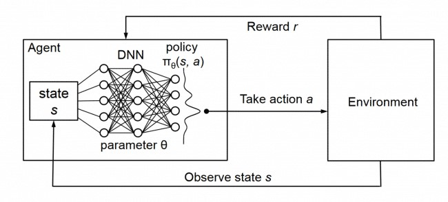   
  Figure 1. Deep Q-Learning

 

 
The true Q-value function Q(S,A) is approximated with a function  Q ̂(S,A,w) as follows:  
The value of parameter vector w for the DNN is calculated such that the least mean square error between the two functions is minimum. The loss function for the DNN is defined as:  
J=1/2 [ Q(S,A)- Q^(S,A,w )]2
  
To minimize the above function, we calculate the gradient of the function w.r.t. parameter vector w:  
∇J=[ Q(S,A)-Q^(S,A,w )].∇Q^(S,A,w ))  
  
The gradient points to the direction of increase of J. Vector w is updated in the direction opposite to ∇J as per equation below
wt+1=wt-α ∇J    
  
wt+1=wt-α [Q(St,At) - Q(St,At,wt )]∇Q ̂(St,At,wt ))    

As we do not know the true Q-value Q(St,At), we use a sample predicted from the current DNN.   
Q(St,At) = Rt+1+γ max a ϵ At+1 Q(St+1,a )  

wt+1=wt-α [Rt+1+γ max a ϵ At+1 Q(St+1,a )) -Q(St,At,wt)]∇Q^(St,At,w ))  

This is called semi-gradient TD-update [5].  
  
There are many issues to be considered while performing a TD-update in Deep Q-Learning. An agent can forget previous experiences with its environment as the training progresses. Also, training data generated by consecutive interaction with the environment can be highly correlated causing the learned model to be biased. Experience-replay is the methodology used to handle such issues during Deep-Q learning. An experience is defined as a tuple [St, At, Rt+1, St+1, done] generated on interaction with the environment, where done is true if training episode is complete else it is set to False. Experiences are stored in a replay buffer and training is performed by ‘replaying’ a batch of random experiences stored in the replay buffer. This ensures that the model learns from the same experience multiple times. Also, since the training batch is randomly selected, it rules out any model bias resulting from training on consecutively generated training samples.

 

## 3. Experiment Setting
The experiment is set for traffic intersections supporting right-side lane driving.This section provides the details of the traffic intersection properties, state-space, action-space, DNN properties, reward function and traffic simulation used for training an Adaptive TLCS agent in this paper.   
### 3.1 Traffic light and Intersection
- The traffic crossing considered in this paper is a 4-way intersection with an arm each in North, South, East and West direction.
- Each arm has 4 lanes approaching the intersection and 4 lanes leaving the intersection
- The length of each arm is 500 m.
- On every arm the right-most lane enables a vehicles to turn right or go straight, the two central lanes bound the driver to go straight while for a vehicle in left-most lane the left turn is the only direction allowed.
- On every arm the left-most lane has a dedicated traffic light while the other 3 lanes share a common traffic light.
- A change in traffic light from ‘Red’ to ‘Green’ or vice-versa requires a mandatory ‘Yellow’ phase in between. 
 
<a/>  
  
### 3.2 State-Space
The state-space for this paper was constructed by assigning incoming lane (towards the traffic-signal), controlled by a dedicated traffic light, to a lane-group. Each lane-group was further divided into 10 lane-cells. Lane-cells near the traffic intersection were configured to be smaller in length as compared to those further away the intersection. This is because vehicles are slow moving and closely spaced near the intersection than away from it (where they can be fast moving and/or sparsely inter-spaced) . Thus, 4 lanes belonging to an arm of a traffic intersection were divided into 2 lane-groups with 10 lane-cells, accounting for 20 lane-cells per traffic intersection arm and 20 x 4 = 80 lane-cells for the complete traffic intersection. State space was implemented as a vector of 80 integers wherein each element represented whether any vehicle was present or absent in a lane-cell:  
**S** =[ e0, e1, e2 … e78, e79 ] where e є {0,1 }  

  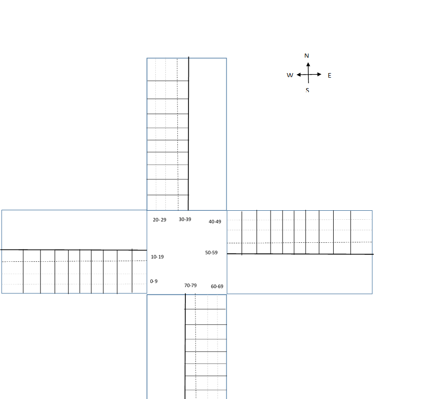   
  Figure 2. State-Space

 

 
### 3.3 Action space
The action-space is the set of all possible action an agent can take. For this paper, each possible action mapped to a traffic light phase. A traffic phase corresponds to possible state of traffic-signals controlling the intersection. The allowed traffic-light phases i.e. action-space was defined as follows:   
A = {NSA, NSLA, EWA, EWLA}  							
- NSA:  North South Advance corresponds to traffic-signal state allowing traffic to go from North direction to South and from South to North.  
- NSLA= North South Left Advance corresponds to traffic-signal state allowing traffic to go from North towards the East and from the South towards West. Traffic in all other directions is stopped.  
- EWA:  East West Advance corresponds to traffic-signal state allowing traffic to go from East direction to West and from West to East. Traffic in all other directions is stopped.  
- EWLA:  East West Left Advance corresponds to traffic-signal state allowing traffic to go from East to South and from West towards North. Traffic in all other directions is stopped.   

<a/>  
  
  
Allowing traffic through in a specific direction requires the corresponding traffic phase to be set to green. Traffic phase is set to green in units of 10 sec.  Transition of traffic phase from one to another requires the former traffic phase to be set to yellow for a duration of 4 sec.  

### 3.4 Deep Neural Network:
The DNN used in our DQN algorithm has the following characteristics:  
Input layer: Takes a 1 x 80 input of binary vector  
Hidden layers: 2 hidden layers of 400 units each with RELU activation function  
Output layer: 1 x 4 units with LINEAR activation function, each unit representing a traffic light phase  

### 3.5 Reward function:
The reward of an action by the agent was calculated by comparing the cumulative wait time of all vehicles in the simulation in the incoming lane, before and after the action is taken. If the action (traffic phase) resulted in vehicles to leave the intersection, it contributed towards decreasing the cumulative wait times, making the reward positive. On the other hand, an action that did not allow vehicles to cross the intersection, resulted in increase in the number of vehicles waiting at the intersection which  in turn resulted in higher cumulative wait times and hence a negative reward.  
  
Rt= 0.9wt-1 - wt  
where wt is the time (in seconds)  waited by  all the vehicles in incoming lanes since the start of environment simulation until time step t. 0.9 is multiplied to wt-1 to stabilize learning. It results in an action to be considered favorable only if it significantly reduces the cumulative wait time of vehicles compared to previous time step. 

### 3.6 Traffic Simulation
Traffic generation during training should resemble real-life situations as far as possible. We therefore used Weibull distribution with shape parameter as 2 to simulate traffic for training. This closely emulated the traffic conditions wherein number of vehicles increased early on, representing peak traffic hours, and then gradually decreased.  Also, 75% of the vehicles were simulated to go straight while 25% of the vehicles were simulated to turn left or right.  
  

  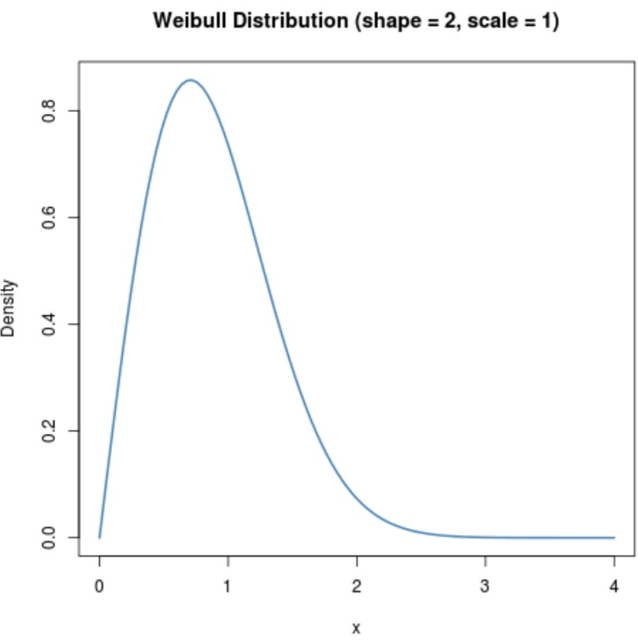   
  Figure 3. Traffic Simulation

 

Total number of vehicles generated for each training episode was 1000. Length of each episode was 1 hour 30 min which is equal to 5400 sec.  The training was performed across 100 episodes. To be sure that the positive results of training were not a consequence of random draw of luck, the training was repeated 3 times and the resulting statistics averaged. 
	  

## 4. SUMO configuration
The traffic light and intersection configuration as described in previous section was implemented using SUMO netedit version 1.3.1 for Windows. netedit is a network editor for eclipse SUMO.
Construction of a network required following steps to be performed.
- Edge Mode : Creation of 4, 2-way edges of length 500 m with a common junction 
- Inspect mode: 
  - Assign junction IDs as JW, JN, JE, JS and TL for traffic junctions corresponding to each direction and traffic light respectively.  
  - Assign edge IDs as N2TL, TL2N, S2TL, TL2S, E2TL, TL2E, W2TL, TL2W based on the direction of the edges. 
- Traffic Light Mode: 
  - A traffic light was added to junction TL.  
  - Traffic phases NSA, NSLA, EWA and EWLA were configured with one green and one yellow phase for each, making a total of 8 phases with IDs 0 through 7.
- Connection Mode: 
  - Connections were edited to ensure that left lane of a 4-lane edge could only turn left, the two center lanes could only go straight and the right-most lane could go straight or right.  
<a/>
The configuration was stored as a net-file in xml format by netedit. 
 

   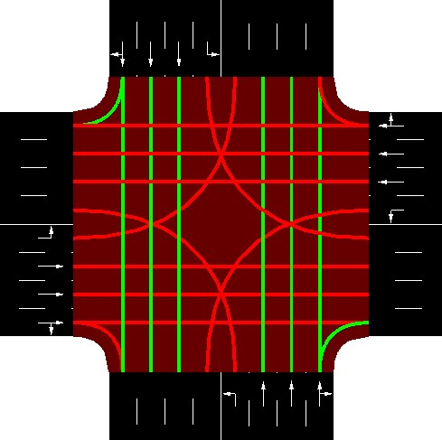
   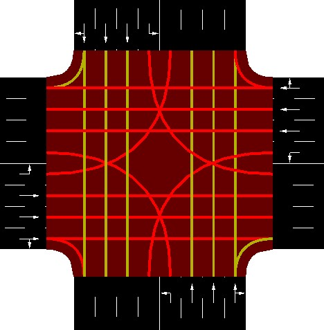 
   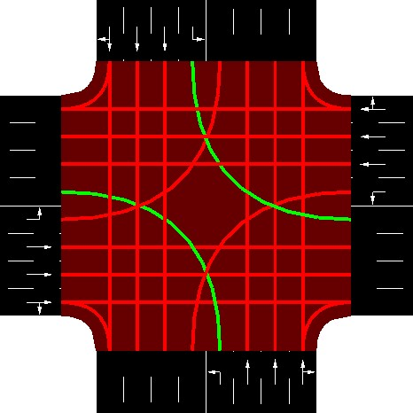
   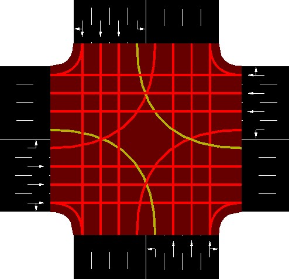 
 
 
  

   
   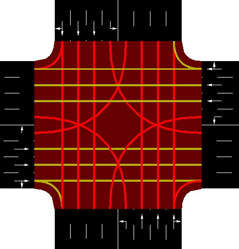 
   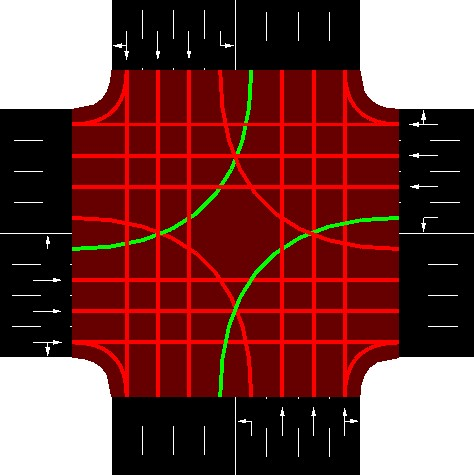
   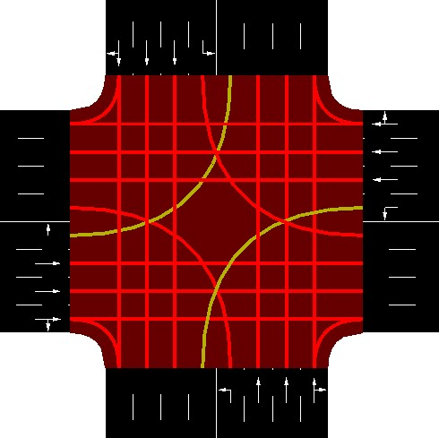 
 
 
 

	Figure 4 Traffic Light Phases
 

  
Traffic for training was generated at run-time, creating a new route-file with 1000 vehicles, at the beginning of every training episode. A route-file is an xml file which defines the route any vehicle takes during simulation. The route-file contains the departure time of every vehicle, the lane and edge that it departs in and the route it takes. The departure time was calculated by sampling from Weibull distribution with shape 2 in range[0-1] and then scaling it to range [0- 5400] sec (duration of a single episode). The vehicles were randomly assigned to edges. Lanes on the chosen edges were also randomly assigned to vehicles such that 75% of the vehicles were configured to go straight and only 25% are configured to turn left or right.  Please refer [2] for details of route-file format. 
Both the network-file and the route-file were configured in a sumocfg file which is required to be provided to sumo.exe for simulation. For details corresponding to a sumocfg file, please refer [3].

	<kbd>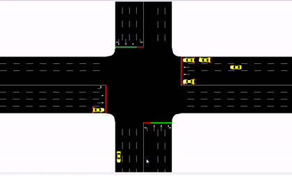 </kbd>   
  Figure 5. Traffic Simulation in SUMO

 
## 5. Implementation Details
The implementation for training an Adaptive TLCS for this paper includes three classes:  

Model: The Model class implements the DNN to approximate the Q-value function. The model is implemented using the Keras v-2.2.4 with Tensorflow v-1.12.0 backend.  
SumoEnv: This class encapsulates the simulation of traffic intersection as described in the previous sections. The class uses TRACI (Traffic Control Interface) to retrieve statistics corresponding  to simulated objects and to manipulate their behavior during training. It provides interfaces that can be used by the agent to :
- Start environment simulation
- Reset environment simulation
- Perform action on the environment and receive rewards for it
- Query existing environment state
- Query statistics, such as, cumulative wait time of all vehicles in a simulation and cumulative intersection queue size at any given time in a training episode.

TLAgent: This class encapsulates the implementation of an adaptive TLCS agent that trains an instance of Model class to approximate Q-value function by interacting with the SumoEnv class. This class implements the DQN algorithm, selecting the actions to be taken on the environment. It also implements a fixed-duration and sequence traffic signal control system (henceforth referred to as FDS TLCS in this paper) agent enabling comparison of performance between adaptive and fixed time-sequence traffic signal control strategies. Following are key implementation details of DQN algorithm implemented in the class
 
- A cyclic replay buffer of size 50000 is created which saves  experiences of the agent with the environment:  Each experience is constituted of a tuple [St, At, Rt+1, St+1, done ] where done is true if training episode is complete else it is set to False.  

- At very time step a batch of 100 random experience tuple are chosen and prepared for training. This approach of learning from cached experiences is called experience replay. The replay logic is implemented as follows:  
  a. Q-values for all actions corresponding to state St  for all samples in the batch are obtained by predicting them from the DNN model.  
  b.  The Q-values corresponding to At for each sample in the batch is updated as per following rules:    
  - If the episode has ended i.e. done = true, Q(St,At)=  Rt+1  ELSE   
  - Predict all Q-values corresponding to state St+1 and find the maximum amongst them  
  - Update Q-value corresponding to At action for state St obtained in step a. as per equation.  
  <a/>  
  c. The input for training consists of array of St in the sampled batch and the target for training are the Q-values updated in step b. above.

- Also, using the same DNN for predicting Q-values to prepare training data and for updating via training can cause big oscillations during training. The situation is similar to chasing a moving target. Therefore, to mitigate this issue our DQN algorithm maintains an additional Target DNN and is used to predict Q-values corresponding to St+1 . The weights of this network are held constant for 10 episodes after which the weights are copied from the trained DNN to the target DNN.  
<a/>   

## 6. Results
This section discusses the training results and evaluates the performance of the adaptive TLCS model against the FDS TLCS agent.  

### 6.1 Training
The following plots are average of 3 training experiments, each for a duration of 100 episodes.

 

  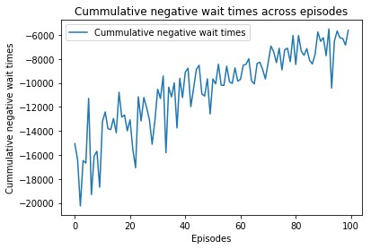
  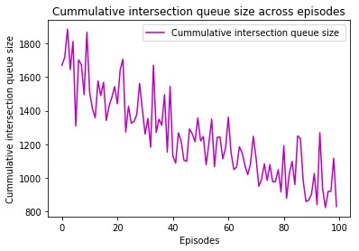
 
   	   

The plots above show how the negative cumulative wait times of vehicles on the traffic intersection experience an overall decrease with every episode as the training progresses. Another statistic, cumulative intersection queue size, also shows progressive decrease during training. Note that the traffic simulation is randomly generated for every episode during training. The better performance of our traffic-signal controller agent on both counts (cumulative negative wait files and traffic intersection queue size) as training progresses proves that our DNN model is successfully learning to adapt traffic-signals to traffic conditions.  
                          
### 6.2 Model Evaluation	
While we can see that Deep Q-Learning can be used to adapt to the traffic behavior, we have not yet shown how this approach compares to the classical FDS traffic system control.  
To do so we generated 100 random traffic simulations in SUMO as per criteria defined in section 3.6.  The same simulations were executed using our learned DQN model and the FDS traffic control model.  During execution, the DNN model was evaluated for optimal policy π* for all the 100 simulations and the performance statistics recorded. Policy π* evaluation involves taking actions that have maximum Q-value in the state where the agent is at any time-step t. Similarly, the performance statistics generated on execution of FDS traffic control system was also recorded.    
 

  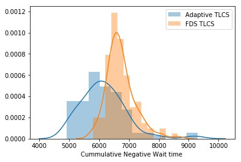
  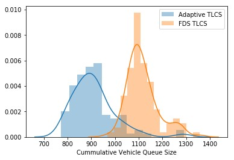
 
   
  
We compared the performance of Adaptive and FDS traffic control system by comparing the cumulative negative wait time (as defined in section 3.5) and cumulative vehicle queue size for each of the 100 simulations. We observe that the mean of both the statistics shifted to the left i.e. vehicles in simulations executed using our adaptive TLCS algorithm experience lesser wait times and queues at the traffic intersection as opposed simulations executed using FDS TLCS.  
  

|	| FDS TLCS  |	Adaptive TLCS |
|-------|----------|------------------|
| x‾nwt  |	6727.438 | 6155.03 |  
| σnwt  | 473.242	 | 774.624 | 
| x‾vqs  |	1116.71	 | 910.33  |
| σvqs  | 66.849	 | 91.869  |

The decrease in mean cumulative wait time for a simulation was observed to be about 8.5% while the decrease in the mean cumulative vehicle queue size of a simulation was observed to be about 18.5 %. 
To ensure that the decrease observed in the mean cumulative negative wait time and mean cumulative vehicle queue size for simulations executed using adaptive TLCS was not due to chance, we also verified that the results were statistically significant.
 
### 6.3 Result Analysis
The results were verified to be statistically significant using left-tailed hypothesis testing. As the 100 simulations used to compare the performance of FDS and Adaptive TLCS were same, the means of statistics used were treated as paired means. To perform hypothesis testing on paired means, the absolute value of measurements obtained for a particular simulation by executing FDS TLCS were subtracted from absolute values of measurements obtained by executing Adaptive TLCS ( to get rid of the negative sign in cumulative wait time measurements)  
  
#### 6.3.1 Cumulative Negative Wait Time  
x_diffwt= x_adapwt - x_fdcswt  
  
x_diff‾wt ̅= 1/n ∑ x_diffwt  
  
We stated the Null and the Alternative hypothesis as below:  

**Ho**: There is no difference between the true mean μ_adapwt and μ_fdswt  and the difference observed in the sample means x_adap‾wt ̅and x_fds‾wt was a matter of chance.  i.e.    
μ_diffwt= μ_adapwt-μ_fdswt= 0 
  
**HA**:  Cumulative negative wait time for all vehicles in traffic simulations executed using Adaptive TLCS algorithm is on an average less than the same traffic simulation executed using FDS TLCS. i.e.  
μ_diffwt<0  
  
Since the standard deviation of the actual distribution  is not known the t-distribution was used for hypothesis testing. For a confidence level of 95% (significance = 0.05), degrees of freedom 99 (100-1) and left-tailed hypothesis testing  
t_c=  -1.66  
t_c is the critical value of the t-score for a 100 sample mean, below which it is safe to reject the null hypothesis Ho.  

 

  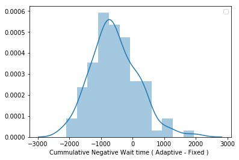
 

 

|	|Adaptive TLCS - FDS TLCS |
|-------|-----------------------|
| x_diff‾wt | -572.404 |
|σ_diffwt | 	733 |

t_score for the simulation sample captured above = -7.8  
  
P_value < 0.00001  
  
Since the calculated p_value << significance (0.05), we safely rejected Ho        
   
#### 6.3.2 Cumulative Vehicle Queue Size  

x_diffvqs= x_adapvqs - x_fdcsvqs  
  
x_diff‾vqs = 1/n ∑ x_diffvqs
      
We stated the Null and the Alternative hypothesis as below:    

**Ho**: There is no difference between the true mean μ_adapvqs and μ_fdsvqs  and the difference observed in the sample means x_adap‾vqs and x_fds‾vqs a matter of chance.  i.e.      
μ_diffvqs= μ_adapvqs-μ_fdsvqs= 0   
  
**HA**:  Cumulative vehicle queue size for all vehicles in traffic simulations executed using Adaptive TLCS algorithm is on an average less than the same traffic simulation executed using FDS TLCS. i.e.    
μ_diffvqs < 0    
  
Since the standard deviation of the actual distribution  is not known the t-distribution was used for hypothesis testing. For a confidence level of 95% (significance = 0.05), degrees of freedom 99 (100-1) and left-tailed hypothesis testing  

t_c=  -1.66  
  
t_c is the critical value of the t-score for a 100 sample mean, below which it is safe to reject the null hypothesis Ho.  
  

 

  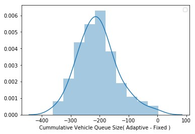
 

 

|	|Adaptive TLCS - FDS TLCS |
|-------|-----------------------|
| x_diff‾vqs ̅| -206.38|
|σ_diff‾vqs | 	69.03 |

t_score for the simulation sample captured above = -29.8   
  
P_value < 0.00001  
  
Since the calculated p_value << significance (0.05), we safely rejected Ho  
  

## 7. Conclusion
We could prove that the proposed approach of building an adaptive TLCS using Deep Reinforcement Learning was not only viable but also more effective than the FDS TLCS. We achieved a reduction of 8.5% in the average cumulative wait time of vehicles at the intersection using adaptive TLCS as compared FSD TLCS and a reduction of about 18.5% in the average cumulative vehicle queue length at the traffic intersection. 
 
## 8. References:
[1] [Eclipse Simulated Urban Mobility](https://www.eclipse.org/sumo/)  
[2] [SUMO Routing file format](https://sumo.dlr.de/docs/Definition_of_Vehicles,_Vehicle_Types,_and_Routes.htm)  
[3] [sumocfg format](https://sumo.dlr.de/docs/Basics/Using_the_Command_Line_Applications.html#configuration_files)  
[4] [TraCI – Traffic Control Interface](https://sumo.dlr.de/docs/TraCI.html)  
[5] Reinforcement Learning. Richard S. Sutton and Andrew G. Barto   
[6] Adaptive Traffic Signal Control: Deep Reinforcement Learning Algorithm with Experience Replay and Target Network Juntao Gao, Yulong Shen, Jia Liu, Minoru Ito and Norio Shiratori  
[7] A Deep Reinforcement Learning Approach to Adaptive Traffic Lights Management Andrea Vidali, Luca Crociani, Giuseppe Vizzari, Stefania Bandini  
